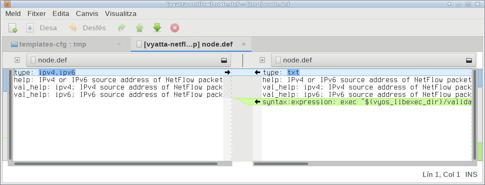

# Migrate an old style script to a new vyos-1.x model

If you want to migrate from an old style template to a new one based in xml you will find this tedious.
Firstly you have to create an xml interface definition by hand from a directory tree full of node.def files with configuration
options, scripts calls, etc...

But vyos people thought about this time ago and developed an XML creator.

So let's see how to import an old style package to a new one model adopted in vyos-1x.

For example, whe want to import vyatta-netflow to new model.

> In this example we have vyos-1x in directory vyos-1x and vyatta-netflow in vyatta-netflow directory.

## Creation of xml file

The piece of software that would help you is in package vyos-1x/scripts/import-conf-mode-commands

If we want to import all config definitions we have to use last script pointing to the directory that contains those definitions.

In our case is in  vyatta-netflow/templates-cfg/system:

```
./vyos-1x/scripts/import-conf-mode-commands vyatta-netflow/templates-cfg/system
```

This script will create an output.xml file with definitions from old vyatta directory skeleton that begins in **system** tag

```
<interfaceDefinition>
  <node name="system">
    <children>
      <node name="flow-accounting">
    [...]
```

But, this is not (yet) a perfect script and doesn't import all the configuration parameters exactly.

We have some work to do ;-)

Our first step is to check if all the xml tags (settings, help messages,...) are imported properly.

A good approach is to do the reverse way, export a directory (with node.def) from our output.xml
.
> Well, is time to find a proper name for our output.xml file, system_flow-accounting.xml looks a good one.
```
mv output.xml system_flow-accounting.xml
```
And rebuild directories and files from our system_flow-accounting.xml: 
```
mkdir tmp
./vyos-1x/scripts/build-command-templates system_flow-accounting.xml ./vyos-1x/schema/interface_definition.rng tmp
```
Our second step is compare the differences between both directories (original in vyatta-netflow and created in tmp)

We can use meld (sudo apt install meld):


or using diff
```
diff -qr  tmp vyatta-netflow/templates-cfg
```

Our third step is to edit our exported xml file and fix what the script didn't import properly.
> If you don't have any differences between vyatta original directories and the one you've created from xml, you'll be
 the luckiest guy in our galaxy. But that should be quite uncommon and you will need to do some work by hand.

# Things to need correction by hand

There are some things that are needed to be corrected
Other things only have changed the syntax and diff (or meld) shows you differences: 
 
## Some types are deprecated.

In some node.def you will see how some types of values are changed in your exported file.

### Example 1.

For example type u32 is moved to a type "text" and a validator:
```
  type: u32
```
is now:
```
  type: txt
  syntax:expression: exec "${vyos_libexec_dir}/validate-value.py  --exec \"${vyos_validators_dir}/numeric --non-negative\" --value \'$VAR(@)\'"; "Invalid value"
```

Same happens with type ipv4:

```
  type: ipv4
```
is now:
```
   type: txt
   syntax:expression: exec "${vyos_libexec_dir}/validate-value.py  --exec \"${vyos_validators_dir}/ipv4-address \" --value \'$VAR(@)\'"; "Invalid value"
```
**In xml this is a constraint**:
```
<constraint>
  <validator name="ipv4-address"/>
</constraint>
```
PERFECT!!!

We don't need to change anything, importer and exporter did they job really well.

But sometimes you want to validate if is a IPv4 or a IPv6, no problem:
```
  type: ipv4, ipv6
```

```
<constraint>
  <validator name="ipv4-address"/>
  <validator name="ipv6-address"/>
</constraint>
```

## multiple validators work as logical **OR**

Well, in this case we have a validator that checks if it's a IPv4 or IPv6 (**ip-address**)

```
<validator name="ip-address"/>
```
## Adding constraint error message

When constraint validator fails is recommended to add a message. For example to warn if a value exceeds the range of allowed values. 

```
<constraint>
<validator name="numeric" argument="--range 0-2147483647"/>
</constraint>
<constraintErrorMessage>Timeout timer must be between 0 and 2147483647.</constraintErrorMessage>

```

**You can see all validators available in vyos-1x/src/validators/**

## There are some scripts missing (not imported). Completion scripts.

### Example 2.
Comparing original (flow-accounting/interface/node.def) with the generated one we can see some differences
 , for example some scripts in perl:
```
allowed: ${vyatta_sbindir}/vyatta-interfaces.pl --show all
create: sudo ${vyatta_sbindir}/vyatta-netflow.pl --action add-intf --intf '$VAR(@)'
delete: sudo ${vyatta_sbindir}/vyatta-netflow.pl --action del-intf --intf '$VAR(@)'
```
Then we need to:
  - look for a vyos script that have the shame behaviour than vyatta-interfaces.pl --show all
  - vyatta-netflow.pl --action add-intf. Well, in fact that is a thing that we need to do later, in our script. We'll se then later on.

Vyos equivalent version of vyatta-interfaces.pl --show all is ${vyos_completion_dir}/list_interfaces.py
So we need to add to our xml:
```
<completionHelp>
<script>${vyos_completion_dir}/list_interfaces.py</script>
</completionHelp>
```
Other options available in list_interfaces.py
- "-t" "--type" List interfaces of specific type
  - ethernet
  - bonding
  - l2tpv3
  - openvpn
  - vxlan
  - wireless
  - tunnel
  - wireless
  - geneve

- "-b" "--broadcast" List all broadcast interfaces
- "-br" "--bridgeable" List all bridgeable interfaces
- "-bo" "--bondable" List all bondable interfaces


**You can see all completion scrips available in vyos-1x/src/completion/**

# Check our xml file

As we are humans is quite probable that we missed something in our xml and we will get an error message like this:
```
flow-accounting.xml:3:0:ERROR:RELAXNGV:RELAXNG_ERR_CONTENTVALID: Element node failed to validate content
```
one helpful tool in linux is jing (sudo apt install jing):

```
jing ./vyos-1x/schema/interface_definition.rng flow-accounting.xml
flow-accounting.xml:256:49: error: element "constraintErrorMessage" not allowed here; expected the element end-tag or element "regex" or "validator"
```